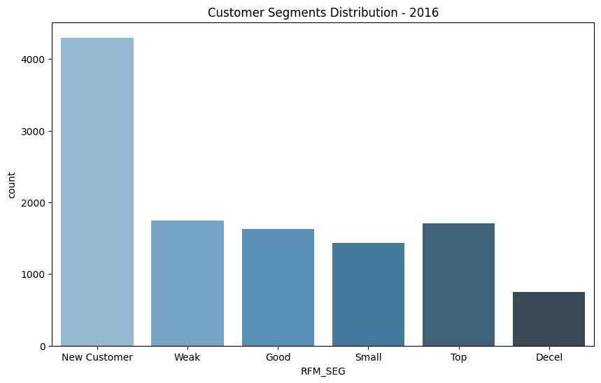
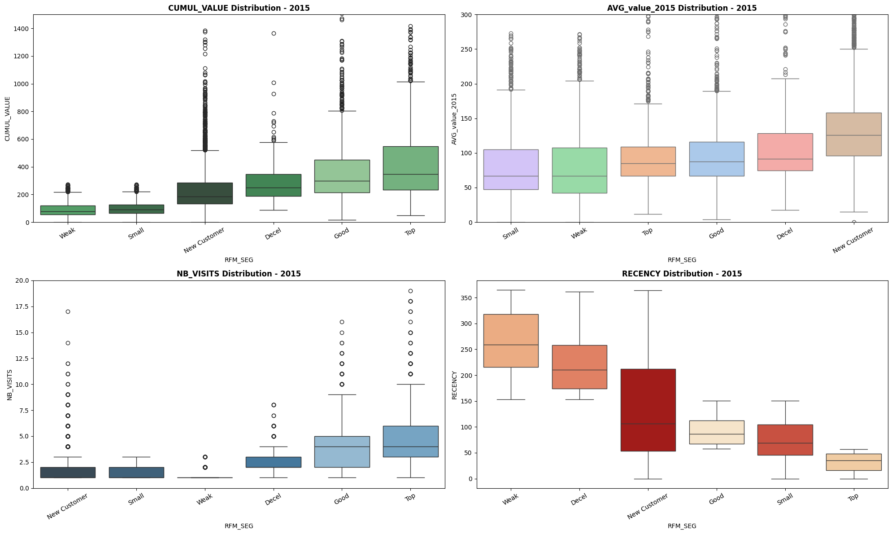
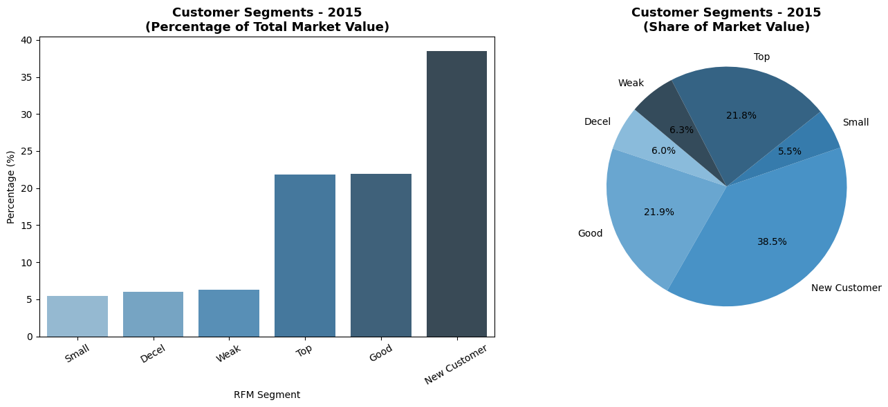
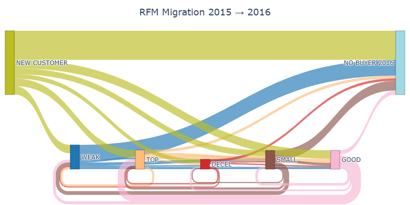
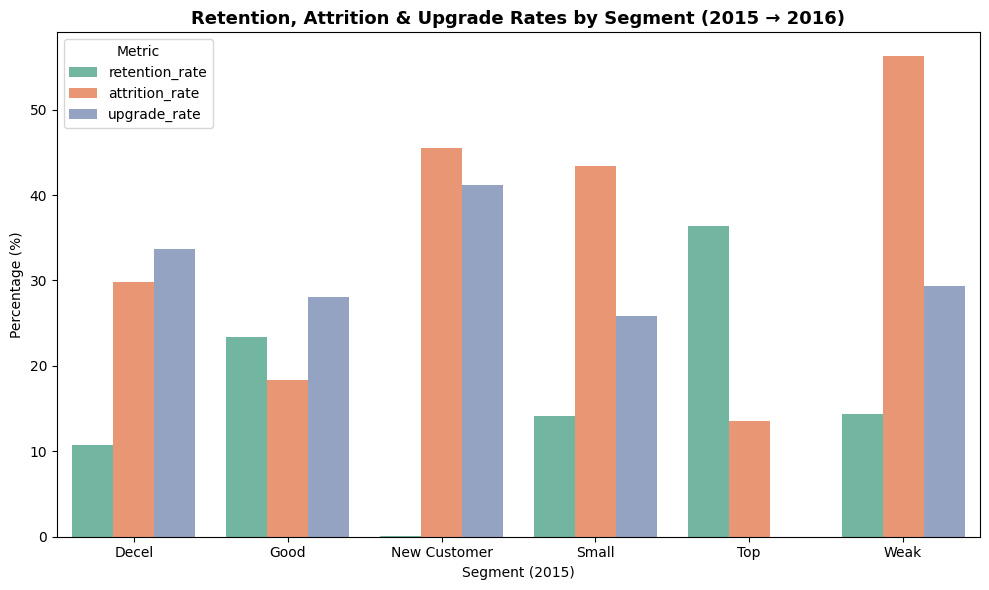
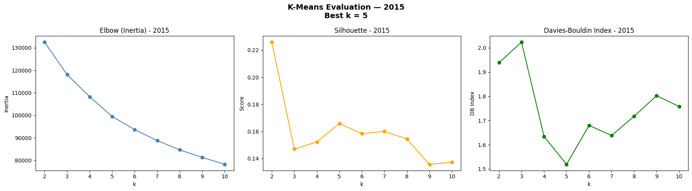
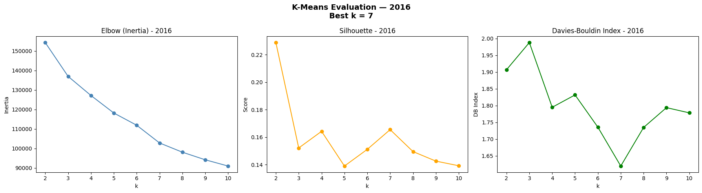
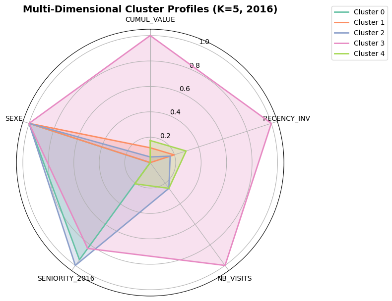

# 🧠 Customer Segmentation & Migration Analysis

### 📌 Overview
This project focuses on understanding **customer behavior, loyalty, and value evolution** across two years (2015–2016) using **RFM segmentation**, analysis the **migration** between segments, and **K-Means clustering**.  
It combines business insights (migration between segments) with data-driven clustering.


---
## 📁 Project Structure

```bash
├─ data/                         
│   ├─ CUSTOMER.csv
│   ├─ CUSTOMER_ADDITIONAL.csv
│   ├─ PRODUCTS.csv
│   ├─ RECEIPTS.csv
│   ├─ REFERENTIAL.csv
│   └─ STORE.csv
│             
│
├─ docs/                                         
│   ├─ elbow_curve.png
│   ├─ cluster_profiles.png
│   ├─ radar_chart.png
│   └─ migration_sankey.png
├─ Notebook_data_prep_segmentation.ipynb 
├─ Notebook_segmentation.ipynb                
└─ README.md                                     

```
---

## ⚙️ Data Preparation Highlights
-   **Data Sources:** Merged multiple CSV files containing customer, receipt, product, and store data. 
- **Feature Engineering:** Computation of key RFM variables and customer attributes:
  - `RECENCY`, `NB_VISITS`, `CUMUL_VALUE`
  - `AGE_2015`, `AGE_2016`
  - `is_PARIS` (binary indicator for Province vs. Paris)
  - `SENIORITY` (number of days as a client)
- **Scaling:** All numerical variables standardized with `StandardScaler` for clustering.
    - $z = \frac{(X - \mu)}{\sigma}$
- **Data Cleaning:** Handling of missing values

**Key Output:**  
✅ Clean, consistent, and normalized dataset ready for segmentation and modeling.

---
## 🔍 Customer Segmentation Analysis for one year
### Exemple of RFM Segmentation using quantiles thresholds in order to define Low, Medium, High for each RFM dimension:
| **Segment** | **Recency** | **Frequency** | **Monetary** | **Description**                     |
|-------------|-------------|---------------|--------------|-------------------------------------|
| **Top**     | Medium         | High          | High         | Most valuable and loyal customers   |
| **Good**  | Low         | Medium       | High         | Loyal customers with growth potential|
| **Decel** | Medium      | Low           | Medium      | Customers who may churn              |
| **Small**     | High        | Medium       | Low         | Recently acquired customers          |
| **Weak** | High        | Low           | Low         | Customers who have stopped buying    |
| **New**  | N/A         | N/A           | N/A          | New customers with `Seniority` < 1 year|

> For the segmentation, additional cases are handled based on specific rules defined in the [Notebook_segmentation.ipynb](./Notebook_segmentation.ipynb) (see notebook for details).

---
### 📊 Some Key Visuals

Below are a few representative charts that summarize the main descriptive insights from the segmentation analysis.
---

#### 1️⃣ Customer Distribution by RFM Segment
The following chart displays the number of customers per RFM segment, allowing an overview balance between segments. The number of NEW customers is notably high, indicating strong acquisition efforts.



####  2️⃣ Distribution of Customer Metrics by Segment
These boxplots show the variability of RFM indicators (CUMUL VALUE, AVG VALUE, Frequency, Recency) across segments, highlighting spending diversity and segments heterogeneity.



---

#### 3️⃣ Market Value Share per Segment
This bar chart shows each segment’s contribution to the total market value, emphasizing which customer groups drive the most revenue. Here, TOP, GOOD and NEW segments dominate the market value and represent more than 80% of total sales.



---
## 🔍 Customer Migration Analysis from 2015 to 2016

### 1️⃣ Visual transition migration Matrix
The plot represents migration matrix, how customers transitioned between RFM segments from 2015 to 2016. 



### 2️⃣ Customer Retention, Attrition, and Upgrade Analysis

Now we evaluate how stable each segment is between 2015 and 2016:  
- **Retention rate:** % of customers staying in the same segment  
- **Attrition rate:** % moving to “NO BUYER”  
- **Upgrade rate:** % moving to higher-value segments  
This helps identify loyal, at-risk, and growing customer groups.


---

## 🤖 K-Means Clustering

### Model Evaluation
Used **Elbow**, **Silhouette**, and **Davies–Bouldin Index** to find the best cluster structure.  

- #### 2015 Evaluation Metrics:

- #### 2016 Evaluation Metrics:


>The most consistent segmentation appears with **k = 5** clusters.
### Cluster Assignments
Clusters applied to both 2015 and 2016 datasets using:

```python
KMeans(n_clusters=5, random_state=42)
```
## 📊 Cluster Profile Analysis

### 1️⃣ RFM-Based Cluster Profiles

Bar charts and radar plots summarize the key differences across **Recency**, **Frequency**, and **Monetary** dimensions for each cluster.

| **Cluster** | **Description** |
|--------------|-----------------|
| **Cluster 3** | High frequency, low recency, and high cumulative value — represents the most loyal and valuable customers. |
| **Cluster 1** | Composed mainly of new customers with medium recency and high average transaction value — a segment with growth potential. |
| **Cluster 4** | Predominantly male customers with medium frequency, low recency, and stable cumulative value — consistent spenders. |
| **Cluster 0 & 2** | Both show low frequency and low cumulative value. However, Cluster 0 contains older customers, while Cluster 2 includes younger women with slightly lower recency (more recent activity). |

**Visualizations include:**
- 📊 Bar plots comparing average **Recency**, **Frequency (Visits)**, and **Monetary (Cumulative Value)** per cluster.  
- 🕸️ Radar chart displaying all RFM dimensions together to compare cluster behavior.



These visual analyses clearly highlight behavioral distinctions between customer groups and serve as a foundation for targeted marketing strategies.


